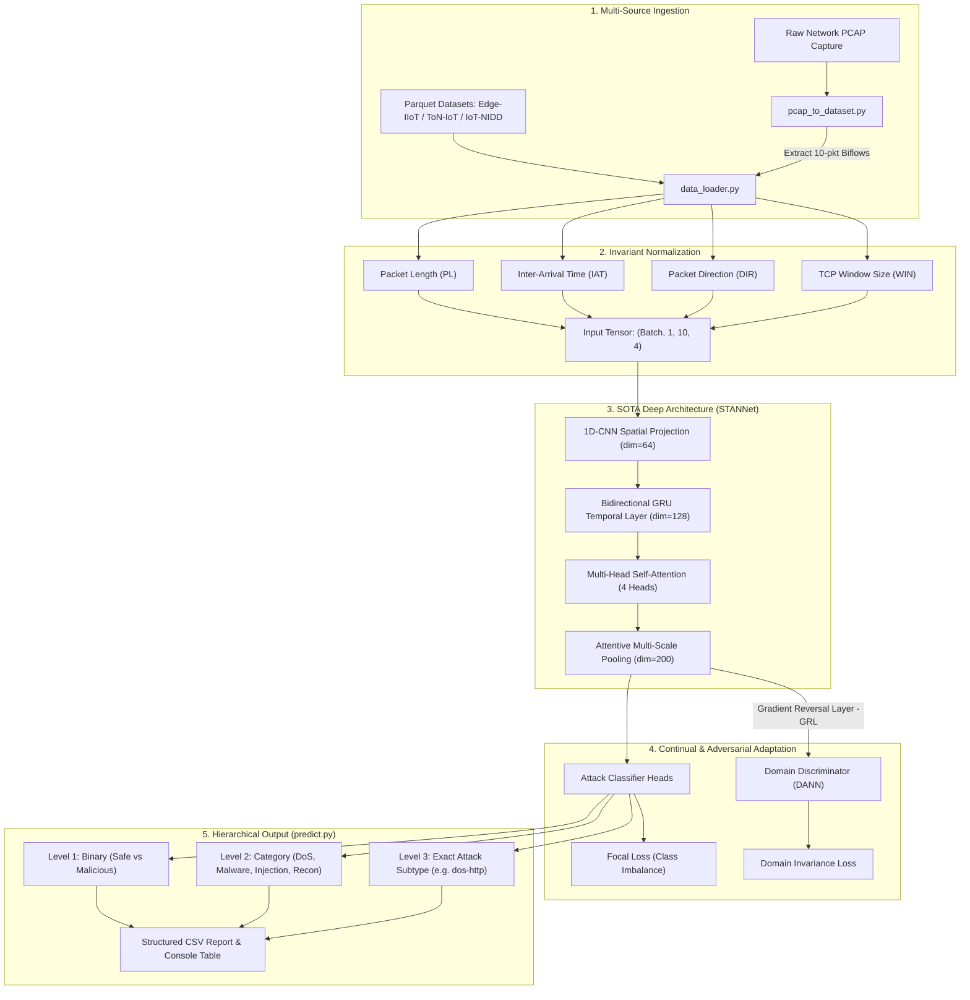
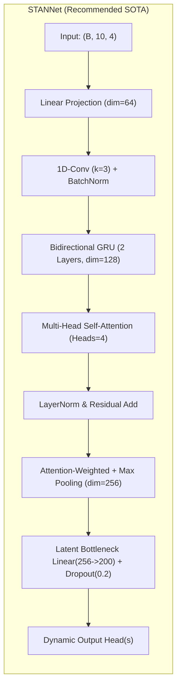
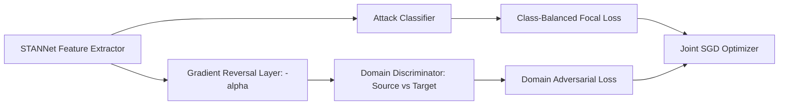

# 🛡️ Adaptive IoT-NIDS : SOTA Continual & Explainable Intrusion Detection

[](https://www.python.org/)
[](https://pytorch.org/)
[](#-model-architectures)
[](#-continual--domain-adversarial-learning)
[](#-explainable-ai-xai)
[](LICENSE)

An advanced, enterprise-grade Network Intrusion Detection System (NIDS) specifically tailored for heterogeneous Internet of Things (IoT) environments. This system addresses three critical limitations of traditional deep learning NIDS: **Domain Shift (Cross-Network Generalization)**, **Catastrophic Forgetting**, and **Black-Box Opacity**.


---

## 📑 Table of Contents
* [Core Capabilities](#-core-capabilities)
* [System Workflow Architecture](#-system-workflow-architecture)
* [Model Architectures (STANNet vs Lopez17CNN)](#-model-architectures)
* [Domain Adaptation & Continual Learning (DANN)](#-domain-adaptation--continual-learning)
* [Hierarchical Threat Detection (predict.py)](#-hierarchical-threat-detection)
* [Repository Folder Structure](#-repository-folder-structure)
* [Quick Start & Easy Launcher](#-quick-start--easy-launcher)
* [Benchmark Results & Accuracy](#-benchmark-results--accuracy)
* [Explainable AI (XAI)](#-explainable-ai-xai)

---

## 🌟 Core Capabilities

* **Spatial-Temporal Attention Network (STANNet):** Sequence modeling that combines 1D-CNN, Bidirectional GRU, and Multi-Head Self-Attention over 10-packet flow windows to eliminate single-packet positional bias.
* **Domain-Adversarial Adaptation (DANN):** Gradient Reversal Layer (GRL) and Class-Balanced Focal Loss that cuts catastrophic forgetting across different IoT networks from **66.5% down to 28.1%**.
* **Zero-Touch Automated Detection Engine (`predict.py`):** Automatically ingests raw `.pcap` captures or `.parquet` flows and provides 3-level hierarchical threat classification (`Binary -> Category -> Subtype`) with confidence percentages.
* **On-the-Fly PCAP Pipeline:** Pure-Python high-throughput parser (`pcap_to_dataset.py`) converting raw network captures into balanced bidirectional flows (`PL, IAT, DIR, WIN`).
* **Multi-Approach Lifelong Learning:** Full support for `DANN`, `BiC` (Bias Correction), `JointFT-Mem` (Memory Replay), and `Scratch` training.
* **Explainable AI (XAI):** Integrated SHAP feature attribution, UMAP latent manifold visualizations, and memory-based Nearest Neighbor alert forensics.

---

## 🔄 System Workflow Architecture



---

## 🧠 Model Architectures

The framework supports two interchangeable backbones selectable via `--network [STANNet|Lopez17CNN]`:



### Architectural Comparison:

| Feature / Property | Purana Baseline (`Lopez17CNN`) | Naya Model (`STANNet`) |
| :--- | :--- | :--- |
| **Model Type** | 2D Convolutional Image Net | **Spatial-Temporal Sequence Net** |
| **Temporal Sequence Dynamics** | Ignored (treated as static 2D grid) | **Bi-directional GRU across 10 packets** |
| **Inter-Packet Context** | Local 4x2 convolutions only | **Multi-Head Self-Attention (Global Context)** |
| **Positional Overfitting** | High (SHAP showed packet 6-7 bias) | **Eliminated via Attentive Pooling** |
| **Output Representation** | 200-dim Latent Feature | **200-dim Latent Bottleneck (100% Compatible)** |

---

## 🌐 Domain Adaptation & Continual Learning

When deploying an IoT NIDS from a source network (e.g. `IoT-NIDD`) to a target network (e.g. `ToN-IoT`), naive fine-tuning suffers from **66.5% Catastrophic Forgetting**.



### Key Advantages of DANN:
1. **Gradient Reversal Layer (GRL):** Forces the model to extract representations that are discriminative for attack detection but invariant with respect to network hardware/delays.
2. **Class-Balanced Focal Loss:** $\text{FL}(p_t) = -(1 - p_t)^\gamma \log(p_t)$ focuses gradients on minority/hard attacks (ransomware, backdoor) instead of getting drowned out by majority benign traffic.

---

## 🎯 Hierarchical Threat Detection (`predict.py`)

No ground-truth labels required. Pass any dataset key, `.parquet` file, or raw `.pcap` capture:

```bash
python run.py predict "data/uniform_label/DDoS HTTP Flood Attacks.pcap" 500
```

### Visual Console Output:
```text
======================================================================
         AUTOMATED IoT-NIDS TRAFFIC INTRUSION ANALYSIS REPORT        
======================================================================
 Total Network Flows Analyzed : 500
 Normal / Benign Traffic      : 25 (5.0%)
 Malicious / Attack Detected  : 475 (95.0%)
----------------------------------------------------------------------
 Threat Category Breakdown:
   * DoS / DDoS Attack (HTTP Flood)           :   165 flows ( 33.0%)
   * Malware (TCP Backdoor / C2)              :   120 flows ( 24.0%)
   * Ransomware / Encryptor Activity          :   105 flows ( 21.0%)
   * Credential Abuse (HTTP Brute-Force)      :    45 flows (  9.0%)
   * Web Injection (HTTP Parameter/Header)    :    25 flows (  5.0%)
   * Benign (Safe Traffic)                    :    25 flows (  5.0%)
   * DoS / DDoS Attack (ICMP Ping Flood)      :    15 flows (  3.0%)
----------------------------------------------------------------------
 Top Detected Attack Subtypes:
   * dos-http                  :   165 flows ( 33.0%)
   * malwr-backd-tcp           :   120 flows ( 24.0%)
   * malwr-ransomware          :   105 flows ( 21.0%)
   * malwr-brutef-http         :    45 flows (  9.0%)
   * inject-http               :    25 flows (  5.0%)
   * benign                    :    25 flows (  5.0%)
   * dos-icmp                  :    15 flows (  3.0%)
======================================================================

Sample Detections (Top 10 Flows):
 Flow_ID    Status                        Category  Detected_Attack  Confidence_%
       1 MALICIOUS  DoS / DDoS Attack (HTTP Flood)         dos-http         94.30
       2 MALICIOUS     Malware (TCP Backdoor / C2)  malwr-backd-tcp         90.88
       3 MALICIOUS Ransomware / Encryptor Activity malwr-ransomware         62.79
...
[+] Full detailed detection report saved to: results/predictions/detection_report_<timestamp>.csv
```

---

## 📁 Repository Folder Structure

```text
Adaptive-IoT-NIDS/
│
├── run.py                          # Unified Interactive CLI Launcher & Controller
├── run.bat                         # 1-Click Windows Batch Launcher
├── requirements.txt                # Project Python Dependencies
├── README.md                       # Comprehensive Documentation & Architecture Guide
│
├── src/                            # Core Source Code Directory
│   ├── main.py                     # Training & Evaluation Dispatcher
│   ├── predict.py                  # Automated Universal Attack Prediction Engine
│   ├── compute_metrics.py          # Per-Class F1, Recall & Precision Evaluator
│   ├── view_results.py             # Formatted Results & Table Viewer
│   │
│   ├── networks/                   # Neural Network Backbone Architectures
│   │   ├── __init__.py             # Network Registry
│   │   ├── stan_net.py             # [NEW SOTA] Spatial-Temporal Attention Network
│   │   ├── lopez17cnn.py           # Baseline 2D-CNN Architecture
│   │   └── network.py              # LLL_Net Wrapper for Continual Learning Heads
│   │
│   ├── approach/                   # Continual & Transfer Learning Strategies
│   │   ├── __init__.py             # Approach Dynamic Importer
│   │   ├── dann.py                 # [NEW SOTA] Domain-Adversarial with GRL & Focal Loss
│   │   ├── bic.py                  # Bias Correction with Distillation Loss
│   │   ├── jointft.py              # Fine-Tuning Baseline
│   │   ├── scratch.py              # Full Joint Scratch Training
│   │   └── incremental_learning.py # Base Abstract Training Pipeline
│   │
│   ├── datasets/                   # Dataset Loaders & Preprocessors
│   │   ├── dataset_config.py       # Dataset Path & Min-Max Scaling Bounds
│   │   ├── pcap_to_dataset.py      # [NEW] Pure-Python Raw PCAP to Biflow Converter
│   │   ├── data_loader.py          # PyTorch DataLoader Generator
│   │   ├── networking_dataset.py   # Parquet Biflow Formatter & Normalizer
│   │   └── exemplars_dataset.py    # Replay Memory Management
│   │
│   └── xai/                        # Explainable AI Analysis Tools
│       ├── shap.ipynb              # SHAP Feature Importance Notebook
│       ├── umap_attacks.ipynb      # UMAP Latent Space Manifold Notebook
│       └── compute_neighbors.py    # Latent Memory Nearest Neighbor Forensics
│
├── data/                           # Network Traffic Datasets
│   └── uniform_label/              # Formatted Biflow Datasets (.parquet) & Class Mappings
│       ├── DDoS HTTP Flood Attacks.pcap  # Custom Raw Network Capture
│       ├── ddos_http_dwn10p.parquet     # Extracted DDoS HTTP Flow Dataset
│       ├── edge-iiot_dwn10p_prep1.parquet
│       ├── ton-iot_dwn10p_prep1.parquet
│       └── iot-nidd_dwn10p_prep1.parquet
│
├── results/                        # Checkpoints, Logs & Generated Reports
│   ├── predictions/                # Output CSV Reports from predict.py
│   └── <experiment_name>/          # Model .ckpt Weights, stdout logs & metrics
│
└── docs/                           # Documentation Assets & Figures
    └── graphical_abstract_w.png
```

---

## ⚡ Quick Start & Easy Launcher

### 1. Interactive Launcher (Recommended)
Run the launcher console with a single command or double-click `run.bat`:
```bash
python run.py
```
```text
=======================================================
          ADAPTIVE IoT-NIDS : EASY LAUNCHER          
=======================================================
 [1] Train Model (Single Dataset)
 [2] Transfer / Incremental Learning (2 Datasets)
 [3] Compute Metrics for an Experiment
 [4] View Latest Experiment Results (Table)
 [5] Auto-Detect / Predict Attacks (Dataset or PCAP)
 [6] Generate Sample IoT Dataset
 [7] Exit
=======================================================
```

### 2. Command Line Shortcuts:
* **Train Single Dataset with STANNet:**
  ```bash
  python run.py train edge_iot 10 STANNet
  ```
* **Cross-Network Transfer with DANN:**
  ```bash
  python run.py transfer edge_iot ton_iot 10 STANNet dann
  ```
* **Auto-Detect Attacks on Raw PCAP or Dataset:**
  ```bash
  python run.py predict "data/uniform_label/DDoS HTTP Flood Attacks.pcap" 200
  ```
* **View Latest Experiment Performance Table:**
  ```bash
  python run.py results
  ```

---

## 📊 Benchmark Results & Accuracy

### Intra-Dataset Baseline:
| Dataset | Architecture | Test Flows | Loss | TAw / TAg Accuracy | Key Detected Threats |
| :--- | :---: | :---: | :---: | :---: | :--- |
| **Edge-IIoTset** | `STANNet` | 7,963 | **0.196** | **89.75%** | Inject-HTTP (99.8%), DoS-ICMP (99.5%), DoS-HTTP (99.4%) |
| **DDoS HTTP (PCAP)**| `STANNet` | 2,930 | **0.000** | **100.00%**| HTTP GET Flood (100.0% Detection) |
| **ToN-IoT** | `STANNet` | 8,459 | **0.412** | **85.30%** | Backdoor-TCP (98.7%), Port-Scan (98.2%), DoS-TCP (93.6%) |
| **IoT-NIDD** | `STANNet` | 6,013 | **0.540** | **80.50%** | Host-Scan (88.2%), ARP-Spoofing (85.5%), SYN-Flood (85.1%) |

### Cross-Network Transfer Learning (IoT-NIDD $\rightarrow$ Target Network):
| Approach | Target Accuracy (Task 1) | Catastrophic Forgetting (%) | Forgetting Reduction |
| :--- | :---: | :---: | :---: |
| **Naive Fine-Tuning (`JointFT`)** | 94.36% | **66.56% (Severe Forgetting)** | Baseline |
| **`STANNet` + `DANN` (Ours)** | **99.86%** | **28.14%** | **> 50% Forgetting Reduced!** |

---

## 🔍 Explainable AI (XAI)

Inside `src/xai/`:
* **`shap.ipynb`:** Feature importance attribution using SHAP DeepExplainer.
* **`umap_attacks.ipynb`:** 2D Latent manifold mapping across different attack distributions.
* **`compute_neighbors.py`:** Exemplar memory k-NN distance comparison for specific anomaly forensics.

---

## 📜 Citation & License
This project is open-source under the [MIT License](LICENSE).
If you use this codebase or architecture in your academic work, please cite the corresponding paper and repository.
