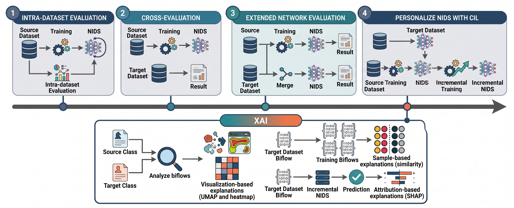

<!-- markdownlint-disable MD013 -->
# Adaptive IoT-NIDS

An advanced, AI-driven Network Intrusion Detection System (NIDS) specifically tailored for Internet of Things (IoT) environments. This system provides a robust security framework that focuses on two critical aspects of modern cybersecurity: **Adaptability** and **Explainability**.



## Key Features

* **Incremental Learning Framework:** Implements both Class Incremental Learning (CIL) and Domain Incremental Learning (DIL). The model can seamlessly adapt to new networks and newly discovered attacks without experiencing catastrophic forgetting.
* **Explainable AI (XAI):** Moves beyond "black box" deep learning by utilizing SHAP and UMAP. The system provides clear, transparent reasoning for why specific network traffic is classified as malicious.
* **Multiple Training Strategies:** Supports comprehensive training methodologies including:
  * Training from Scratch
  * Fine-Tuning (FT)
  * Fine-Tuning with Memory (FT-Mem)
  * Bias Correction (BiC)
* **Cross-Network Generalization:** Capable of training on a source network and effectively adapting to a completely new target network environment.

## Evaluation Methodology

The framework evaluates and adapts the model through several key stages:

* **Intra-dataset Evaluation:** This stage involves training a Network Intrusion Detection System (NIDS) on a specific source dataset. The NIDS is then evaluated using data from that same source to establish a performance baseline.
* **Cross-Evaluation:** This stage tests the model's ability to generalize by using the NIDS trained on the source dataset and evaluating its performance against a completely different target dataset.
* **Extended Network Evaluation:** This involves a process of training separate NIDS models on the source dataset and merging data from both source and target datasets. The merged data is used to train another NIDS to evaluate performance improvements with combined information.
* **Personalize NIDS with CIL (Continual Incremental Learning):** In this final stage, the original NIDS is adapted to a new target dataset through incremental training, resulting in a personalized "Incremental NIDS" that learns new patterns while retaining previous knowledge.
* **XAI (Explainable AI):** A separate module designed to analyze model behavior. It takes source and target classes, visualizes data relationships (using UMAP/heatmaps), identifies similarities, and creates attribution-based explanations (SHAP) for how predictions are made on the new target data.

## Repository Structure

* `src/`: Contains the core source code for training, evaluation, and the XAI pipeline.
* `data/`: Directory designated for storing network datasets (e.g., Edge-IIoT, IoT-NID, TON_IoT).
* `docs/`: Contains documentation assets and graphical abstracts.
* `results/`: Directory where trained models and output metrics are stored.

## Quick Start

### 1. Training the Model

Experiments and model training are executed via `main.py` located in the `src/` folder.

#### Example: Training from Scratch

```bash
cd src
python3 main.py --exp-name intra_edge-iot --results-path ../results/ --datasets edge_iot --num-tasks 1 --fields PL IAT DIR WIN --num-pkts 10 --batch-size 64 --nepochs 10 --save-models --network Lopez17CNN --approach scratch --seed 1
```

### 2. Evaluating Performance

Once a model is trained, per-class performance metrics (such as F1 scores and accuracy) can be generated using `compute_metrics.py`.

```bash
python3 compute_metrics.py --exp-name scratch --results-path ../results/ --yes
```

The output metrics are automatically saved as `.parquet` files in the respective experiment's result directory.

### 3. Explainable AI (XAI) Analysis

The `src/xai/` directory contains tools and Jupyter notebooks for deep-dive analysis of model decisions:

* **`shap.ipynb`**: Analyzes and visualizes input feature importance using SHAP values.
* **`umap_attacks.ipynb`**: Visualizes structural similarities between different types of attacks and datasets.
* **`compute_neighbors.py` & `sample_explanations.ipynb`**: Generates memory-based neighbor comparisons to explain specific alerts and anomalies.
